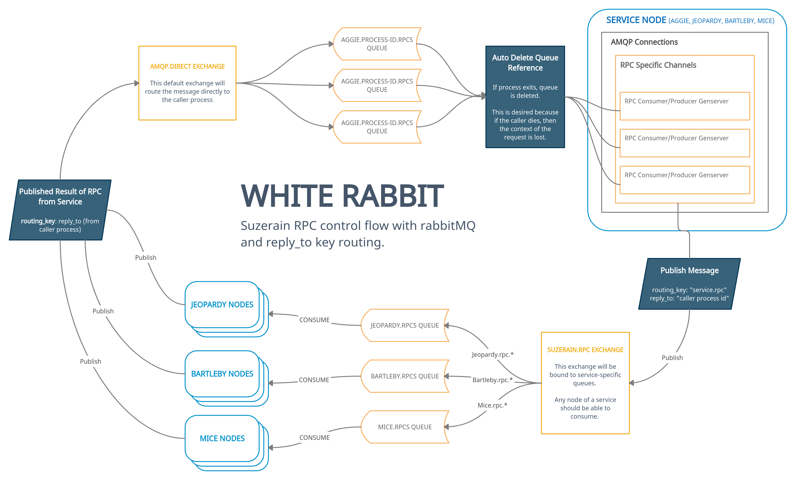

# White Rabbit

RabbitMQ Elixir library to handle all consuming, producing, and exchanging of RabbitMQ messages.

# Implementing

## Add To Dependencies
```elixir
  defp deps do
    [
      {:white_rabbit, path: "path/to/project"},
    ]
  end
```

## Use As A Behavior:

```elixir
# In MyApp

defmodule MyApp.WhiteRabbit do
    use WhiteRabbit

  def start_link(_opts) do
    WhiteRabbit.start_link(__MODULE__, name: __MODULE__)
  end

  # Callbacks below
end
```

```elixir
# In Main Application Supervisor

children = [
  # other fun stuff...
  {MyApp.WhiteRabbit, []}
]

Supervisor.start_link(children, opts)
```

## Testing

### Start Dynamic Consumers

The processor module needs to exist befre trying to register a consumer for it.
```elixir
aggie_config = %WhiteRabbit.Consumer{
  name: "Aggie.TestJsonProcessor",
  exchange: "json_test_exchange",
  queue: "json_test_queue",
  processor: %WhiteRabbit.Processor.Config{module: Aggie.TestJsonProcessor}
}

jeopardy_config = %WhiteRabbit.Consumer{
  name: "Jeopardy.TestJsonProcessor",
  exchange: "jeopardy_json_test_exchange",
  queue: "jeopardy_json_test_queue",
  processor: %WhiteRabbit.Processor.Config{module: Jeopardy.TestJsonProcessor}
}

WhiteRabbit.Consumer.test_start_dynamic_consumers(aggie_config, 3)
WhiteRabbit.Consumer.test_start_dynamic_consumers(jeopardy_config, 3)
```

### Test Publish to Exchange
```elixir
WhiteRabbit.Core.test_publish(100, "json_test_exchange", "test_json", %{hello: "there"})
WhiteRabbit.Core.test_publish(100, "jeopardy_json_test_exchange", "test_json", %{hello: "there"})
```

## To Generate ExDocs

`mix docs`

## To Do

- [ ] Runtime config from external data source
- [ X ] Consumer and Producer Dynamic Supervisor topology
- [ ] RPC control flow
  Concept:
  

- [ ] Auto-scaling of event processing with `L = lw`
    ```
    L - # of msgs
    l - rate of arrival
    w - avg time it takes to process 1 message

    Kill/Spawn new processer module to keep a constant time performance level 
  ```

- [ ] Telemetry event emission